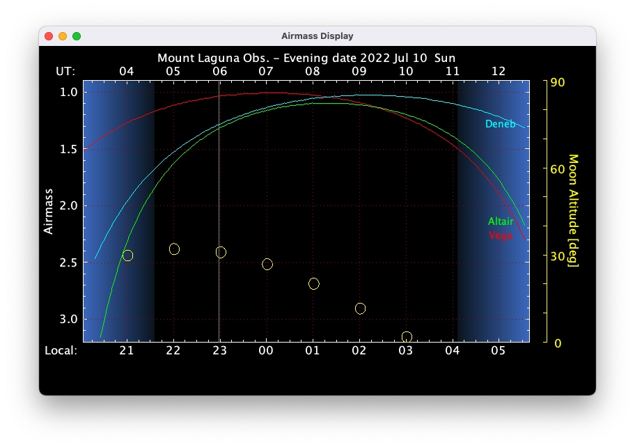

<br>

JSkycalc expedites the "time-and-the-sky" calculations needed by observational astronomers. The most up to date instructions to install on Apple M1 chip, install Oracle-Java JDK, and add new site locations.

**ATTENTION:** John Thorstensen's Dartmouth website is no longer is use: [dartmouth.edu/~physics/labs/skycalc](https://dartmouth.edu/~physics/labs/skycalc)

## Download .jar File

Go to [John Thorstensen's][2] GitHub page and download the `JSkyCalc.jar` executable jar file.

## Create a New Directory in Home Folder

I suggest creating a new folder in your home directory and placing the jar file in there. If your jar file is in your Downloads folder after downloading from John's site, you can copy paste the three (3) commands to your terminal and you should end up in your `jskycalc` directory, under your home folder.

```bash
mkdir ~/jskycalc
```

```bash
mv ~/Downloads/JSkyCalc.jar ~/jskycalc
```

```bash
cd ~/jskycalc
```

## Install Oracle-Java JDK Download

Run the java command on the jar file and it should start right up. If you don't have java installed in your system you will get a messege:

```
The operation couldn’t be completed. Unable to locate a Java Runtime.
Please visit http://www.java.com for information on installing Java.
```

Do not go to Java.com. Instead use this link [Oracle-Java][1].  Click on "Arm 64 DMG Installer" option from **Java SE 18** section and then download the `jdk-18_macos-aarch64_bin.dmg` file. Double-click on the DMG file you downloaded and follow install instructions.

```bash
java -jar JSkyCalc.jar
```

## Unpack Files from Jar File

To add Mount Laguna Observatory to JSkyCalc, start by unpacking the jar file.

```bash
jar -xvf JSkyCalc.jar
```

## Add a New Site Location as Default

The following is the general format for adding new site locations:

1. Name, in quotation marks; keep it succinct; must be unique.
2. Longitude, expressed in DECIMAL HOURS, POSITIVE WESTWARD.
3. Latitude, in decimal degrees, positive northward.
4. Offset of standard time from UT, in decimal hours with decimal included positive -> west of Greenwich, negative -> east.
5. Integer code for the convention used for daylight savings time; 0 -> off, 1 -> USA (keyed to year, includes 1987 revisions), 2 -> a Spanish convention (I think), -1 -> Chilean (negative sign for southern hemisphere logic), -2 -> Australian.
6. Name of the time zone in quotation marks.
7. A 1- or 2-character code for the timezone (e.g. "C" for central).
8. The elevation of the observatory above sea level, in meters.
9. An estimate of the elevation of the obs. around the terrain that forms its horizon, used for adjusting rise-set times.  THIS CANNOT BE NEGATIVE (negative values cause a square-root domain error and are ignored).

Open `skycalcsites.dat` and add Mount Laguna Observatory as the first site (above Kitt Peak)--it will become the default.

```
"Mount Laguna Obs.", 7.76173, 32.84, 8., 1, "Pacific", "P", 1859., 1859.
```

## Save Changes to Jar File

Reconstruct the jar file and all the changes will take effect (**DO NOT** forget the period at the end of command).

```bash
jar -cvmf myManifest.mf JSkyCalc.jar .
```

## Environment setup

Add following lines to your `~/.zshrc` file and you will be able to start JSkyCalc from any directory.

```bash
alias jsky='java JSkyCalc'
CLASSPATH=$CLASSPATH:~/JSkyCalc
export CLASSPATH
```

Finally, use the command `source ~/.zshrc` to source the file and then use jsky command to start using JSkyCalc from any directory! 

## Sky Objects to Target

The following line is the general format for JSkyCalc (.dat) files:

```
Name_no_blanks hh mm ss dd mm ss equinox +++
```

It's fine if all your stars have equinox=2000. Here is an example of `observe-star.dat` formatted for JSkyCalc.

```
Vega 18 36 56.34 38 47 01.2802 2000.0 +++
Altair 19 50 46.99855 08 52 05.9563 2000.0 +++
Deneb 20 41 25.9 45 16 49 2000.0 +++
```



## References

1. [Oracle-Java][1]: The JDK is a development environment for building applications and components using the Java programming language.

2. [JSkyCalc][2]: JSkycalc expedites the "time-and-the-sky" calculations needed by observational astronomers.

[1]: https://www.oracle.com/java/technologies/downloads/#jdk18-mac
[2]: https://github.com/jrthorstensen/JSkyCalc